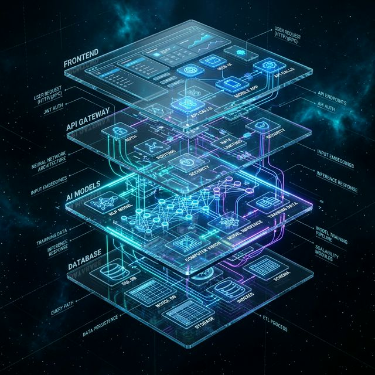
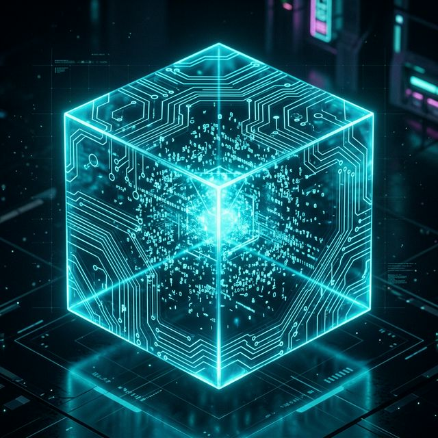
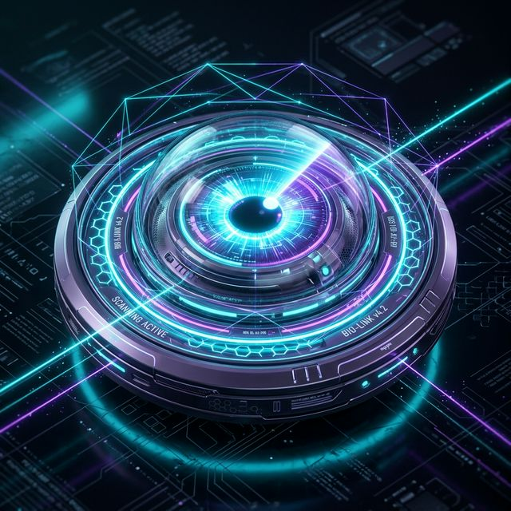

<div align="center">
  
  
  <br />

  # 🌌 **PAYTM AI MERCHANT COPILOT**
  ### *The Definitive Multi-Layer Intelligent Orchestration Platform*

  <p align="center">
    <a href="https://github.com/kartikeya2006jay/AI-Businesses">
      
    </a>
    <a href="#">
      
    </a>
    <a href="#">
      
    </a>
  </p>

  ---
  
  **Transforming traditional merchant operations into an autonomous, data-driven ecosystem powered by Generative AI and High-Velocity Analytics.**
  
  ---
</div>

## 🧩 **CORE ARCHITECTURAL PILLARS**

<table align="center">
  <tr>
    <td width="33%" align="center">
      
      <h3><b>NEURAL BRAIN</b></h3>
      <p><i>Context-aware LLM orchestration for strategic business intelligence and autonomous decision support.</i></p>
    </td>
    <td width="33%" align="center">
      
      <h3><b>ML DATA MESH</b></h3>
      <p><i>High-fidelity predictive telemetry pipelines utilizing Scikit-learn for revenue & sales trajectory mapping.</i></p>
    </td>
    <td width="33%" align="center">
      
      <h3><b>VISION HUB</b></h3>
      <p><i>Autonomous visual processing for inventory audits and automated document residency mapping.</i></p>
    </td>
  </tr>
</table>

---

## 🏛️ **3D EXPLODED TOPOLOGY**

> **The platform is built on a high-density vertical stack, ensuring absolute separation of concerns while maintaining low-latency cross-layer communication.**

1.  **Holographic Frontend**: A React-driven interface utilizing Framer Motion for liquid-smooth 3D state transitions.
2.  **Neural Gateway**: A FastAPI-powered backbone handling high-concurrency routing and secure merchant authentication.
3.  **Intelligence Layer**: A localized mesh of OpenAI models and custom Scikit-learn predictors optimized for merchant-scale data.
4.  **Persistent Ledger**: Isolated data residency ensuring strict multi-tenant privacy and merchant-level encryption.

---

## �️ **HIGH-PERFORMANCE TECH MESH**

<div align="center">

| LAYER | TECHNOLOGY | ROLE | AESTHETIC |
| :--- | :--- | :--- | :--- |
| **FRONTEND** | React 18 / Recharts | Dashboard Orchestration | Glassmorphic / 3D Motion |
| **BACKEND** | FastAPI / Python | High-Velocity Logic | Minimalist / Efficient |
| **AI CORE** | OpenAI / Scikit-Learn | Generative & Predictive | Neural / Adaptive |
| **VISION** | OpenCV | Spatial Intelligence | Autonomous / Analytical |

</div>

---

## 🚀 **MISSION INITIALIZATION**

### **STP 1: DEPLOY NEURAL CORE**
```bash
cd backend
python -m venv venv && source venv/bin/activate
pip install -r requirements.txt
./run_server.sh
```

### **STP 2: ACTIVATE HOLOGRAPHIC INTERFACE**
```bash
cd frontend
npm install --force
npm start
```

---

## 📂 **SYSTEM ONTOLOGY**

```yaml
paytm-ai-merchant-copilot:
  - backend: 🐍 Python Neural Logic
    - app: Logic Core
      - api: Intelligence Matrix
      - services: Neural Workflows
  - frontend: ⚛️ React Visual Hub
    - src:
      - components: Glassmorphic UI
      - styles: Cyber-Thematic Design
  - doc: 📖 Architectural Blueprints
```

---

<div align="center">
  
  <br />
  <p><b>A Product of Strategic Innovation by Kartikeya</b></p>
  <p><i>Empowering the next billion merchants with AI.</i></p>
</div>
