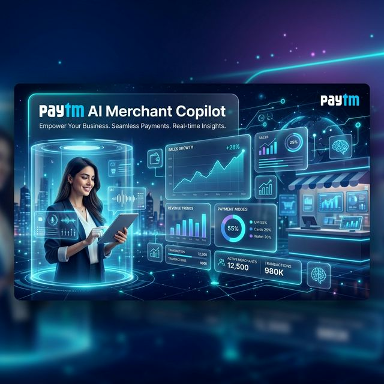
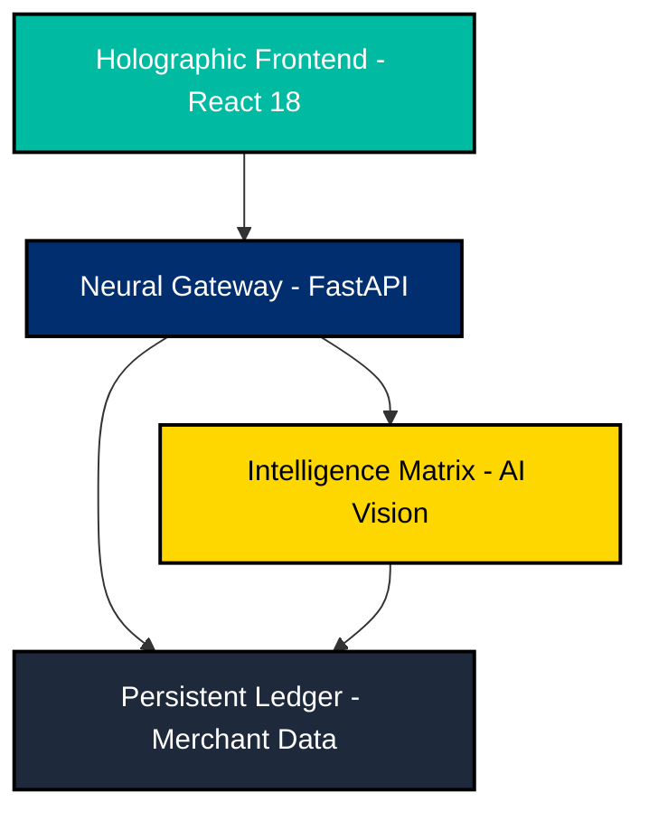

# <p align="center">� **PAYTM AI MERCHANT COPILOT** 🌠</p>
<p align="center"><i>The Definitive Multi-Layer Intelligent Orchestration Platform for Next-Gen Merchants</i></p>

<div align="center">
  
  
  <br />

  <p align="center">
    <a href="https://github.com/kartikeya2006jay/paytm-ai-merchant-copilot">
      
    </a>
    <a href="#">
      
    </a>
    <a href="#">
      
    </a>
  </p>

  ---
  **Transforming traditional merchant operations into an autonomous, data-driven ecosystem powered by Generative AI and High-Velocity Vision Analytics.**
  ---
</div>

## 🌌 **SYSTEM OVERVIEW: THE HOLOGRAPHIC STACK**

<details open>
<summary><b>�️ ARCHITECTURAL BLUEPRINT (Click to toggle)</b></summary>
<br />

> **The platform is built on a high-density vertical stack, ensuring absolute separation of concerns while maintaining low-latency cross-layer communication.**

1.  **💠 Holographic Frontend**: A React-driven interface utilizing Framer Motion for liquid-smooth 3D state transitions.
2.  **⚡ Neural Gateway**: A FastAPI-powered backbone handling high-concurrency routing and secure merchant authentication.
3.  **🧠 Intelligence Matrix**: A localized mesh of custom AI models optimized for merchant-scale telemetry.
4.  **📒 Persistent Ledger**: Isolated merchant residency ensuring strict privacy and merchant-level encryption.
</details>

---

## ⚡ **MISSION-CRITICAL CAPABILITIES**

### 📦 **REVOLUTIONARY STOCK REPOSITORY**
> *AI that sees your business before you do.*
- **`VISION-SCAN`**: Scan items with 98% accuracy using real-time AI product recognition.
- **`AUTO-CATALOG`**: Instant metadata injection (Price, Stock, Class) upon item detection.
- **`INTELLIGENT-REORDER`**: Predictive reordering suggestions based on merchant turnover velocity.

### � **NEURAL KHATA BOOK (CREDIT LEDGER)**
> *The smart way to handle receivables.*
- **`ONE-CLICK-LIQUIDATE`**: Premium liquidation portal for instant debt settlement.
- **`CUSTOMER-IDENTITY-MESH`**: Beautifully rendered customer profiles with real-time credit metrics.
- **`GLASS-UI-CONTRAST`**: High-fidelity dark/light mode optimization for maximal visibility safely from the counter.

### 📈 **HOLOGRAPHIC TELEMETRY**
> *Data transformed into actionable intelligence.*
- **`REVENUE-TRAJECTORY`**: Beautifully animated charts showing profit extraction peaks.
- **`SYSTEM-INTEGRITY`**: Real-time nominal health checks across the entire business ecosystem.

---

## 🏛️ **3D EXPLODED TECHNOLOGY TOPOLOGY**



---

## 🚀 **MISSION INITIALIZATION: ZERO-CONFIG DEPLOY**

### 🟢 **STP 1: DEPLOY NEURAL CORE**
```bash
# Initialize the ecosystem backbone
cd backend
python -m venv venv && source venv/bin/activate
pip install -r requirements.txt
./run_server.sh
```

### 🔵 **STP 2: ACTIVATE HOLOGRAPHIC HUB**
```bash
# Launch the merchant visual terminal
cd frontend
npm install --force
npm start
```

---

## 📂 **SYSTEM SYSTEM ONTOLOGY**

```yaml
paytm-ai-merchant-copilot:
  - backend: 🐍 Python Neural Logic
    - app: Logic Core Matrix
      - api: Intelligence Handlers (Khata, Inventory, POS)
      - services: Autonomous Neural Workflows
  - frontend: ⚛️ React Visual Hub
    - src:
      - components: Glassmorphic UI Elements
      - styles: Cyber-Thematic CSS v4.0
  - docs: 📖 Architectural Blueprints
```

---

<div align="center">
  
  <br />
  <p><b>Designed by Kartikeya – The Future of Merchant Operations</b></p>
  <p><i>Empowering local businesses with enterprise-grade Neural Intelligence.</i></p>
</div>
