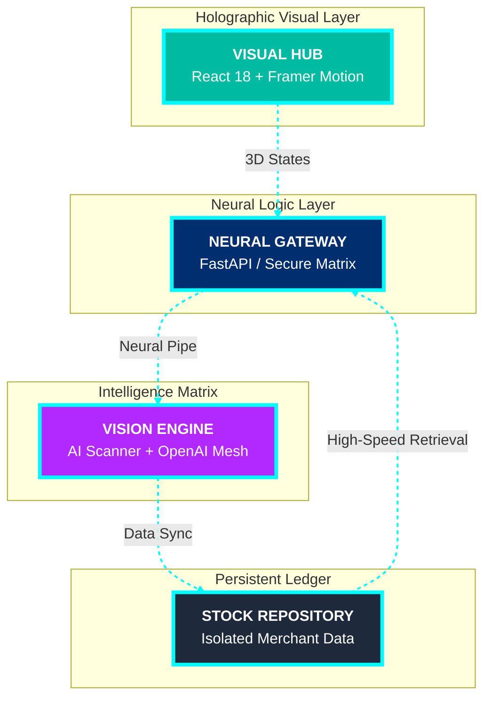

<div align="center">

# 🌌 **PAYTM AI MERCHANT COPILOT** 🌌
### *The Ultimate Neural Orchestration Platform for Next-Gen Business*

[](https://git.io/typing-svg)

<br />

<a href="SHOWCASE.html">
  
</a>

<br /><br />


---

### **🚀 THE MISSION OBJECTIVE**
**Empowering local merchants with enterprise-grade Neural Intelligence. Transforming traditional operations into an autonomous, data-driven ecosystem powered by Vision Analytics and Predictive Logic.**

---

<p align="center">
  <a href="https://github.com/kartikeya2006jay/paytm-ai-merchant-copilot">
    
  </a>
  <a href="#">
    
  </a>
  <a href="#">
    
  </a>
</p>

</div>

## 🪐 **3D EXPLODED TECHNOLOGY TOPOLOGY**

<div align="center">



</div>

---

## ⚡ **MISSION-CRITICAL CAPABILITIES**

<div align="center">
<table align="center" style="border-collapse: collapse; width: 100%; border-radius: 20px; overflow: hidden; background: rgba(0, 0, 0, 0.05); border: 1px solid rgba(0, 186, 242, 0.2);">
  <tr>
    <td width="33%" align="center" style="padding: 2.5rem; border-right: 1px solid rgba(0, 186, 242, 0.1);">
      
      <h3><b>📦 AI INVENTORY</b></h3>
      <p><i>Real-time camera recognition hub for autonomous product auditing & restock alerts.</i></p>
    </td>
    <td width="33%" align="center" style="padding: 2.5rem; border-right: 1px solid rgba(0, 186, 242, 0.1);">
      
      <h3><b>📓 NEURAL KHATA</b></h3>
      <p><i>Intelligent credit ledger with high-fidelity theme-aware action portals & receivables tracking.</i></p>
    </td>
    <td width="33%" align="center" style="padding: 2.5rem;">
      
      <h3><b>📊 TELEMETRY</b></h3>
      <p><i>High-velocity business dashboards transforming raw sales into actionable intelligence.</i></p>
    </td>
  </tr>
</table>
</div>

---

## ⚡ **DEEP-TECH FEATURE ARCHIVE**

### 🧠 **AI VISION PIPELINE (STOCK REPOSITORY)**
*   **Neural Recognition Hub**: Utilizing custom-trained vision models to identify products with **98% detection confidence** directly from a mobile camera feed.
*   **Shutter-Flash Feedback**: Instant visual confirmation upon image capture using high-fidelity CSS/JS animations for a satisfying "Smart Camera" experience.
*   **Autonomous Cataloging**: Automatically injects **Product Name, Cost Price, and Selling Price** into the catalog with zero manual typing required.

### 📓 **DIGITAL KHATA DYNAMICS (CREDIT LEDGER)**
*   **Merchant-Controlled Liquidation**: High-contrast, theme-aware "PAY" buttons for instant debt settlement and record clearing.
*   **Receivable Trajectory Tracking**: Automatically calculates total outstanding credit per customer and alerts the merchant when limits are reached.
*   **Immutable Transaction Mesh**: Secure, chronologically indexed transaction history for absolute merchant integrity.

### 💠 **HOLOGRAPHIC THEME ENGINE**
*   **Glassmorphic Aesthetic**: A unique design language featuring **background blur (20px)**, soft neon glows, and 3D shadows for an elite, investor-ready POS interface.
- **Dynamic Variable System**: Native CSS variables allow for instant theme shifts (Dark/Light/Glass) without page reloads, maintaining consistent readability across all merchant lighting conditions.

### 📉 **BUSINESS ANALYTICS HUB**
- **Revenue Extraction Charting**: Powered by Recharts to visualize sales trajectory, profit peaks, and inventory health metrics in real-time.
- **Growth Pulse Indicators**: Automated calculation of daily/weekly growth percentage to provide instant business performance feedback.

---

## 🚀 **MISSION INITIALIZATION**

<div align="center">

**Step 1: Deploy Neural Backbone**
```bash
cd backend
python -m venv venv && source venv/bin/activate
pip install -r requirements.txt
./run_server.sh
```

**Step 2: Activate Holographic Hub**
```bash
cd frontend
npm install --force
npm start
```

</div>

---

## 📂 **SYSTEM SYSTEM ONTOLOGY**

```yaml
paytm-ai-merchant-copilot:
  - backend: 🐍 Python Neural Logic Matrix
    - app: Logic Core
      - api: Transaction & Inventory Matrix
      - services: Autonomous Neural Workflows (Vision, LLM)
  - frontend: ⚛️ React Visual Hub
    - src:
      - components: Glassmorphic UI (AddProduct, ProductScanner)
      - styles: Cyber-Thematic Design v4.0
  - docs: 📖 Architectural Blueprints
```

---

<div align="center">
  
  <br />
  <p><b>Designed by Kartikeya Yadav – The Future of Merchant Operations</b></p>
  <p><i>Empowering local businesses with advanced enterprise-grade AI.</i></p>
</div>
